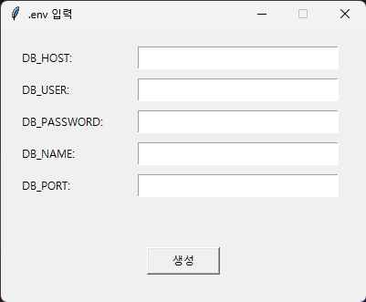

# Prompt - LLM Virtual Trade (Backtesting)
---
## Support
- LLM API Model : GPT-5.0-mini and Gemini 3.0 Flash / 2.5 Pro
- Exchange : Upbit
- Databse : Postgres
---
## OS
- Windows 11
---
## FORM

- **DB_HOST**: Database host (e.g., `localhost`)
- **DB_USER**: PostgreSQL username (e.g., `postgres`)
- **DB_PASSWORD**: PostgreSQL user password
- **DB_NAME**: Your database name
- **DB_PORT**: Database port (e.g., `5432`)