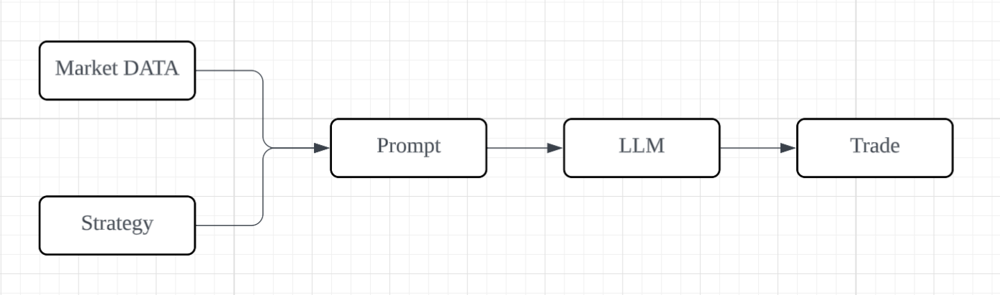
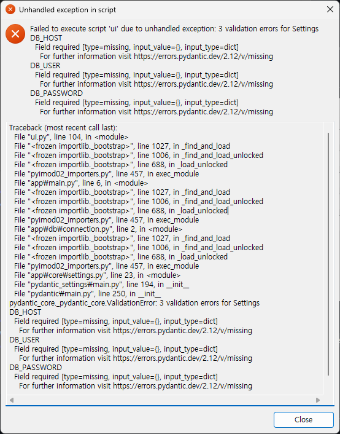
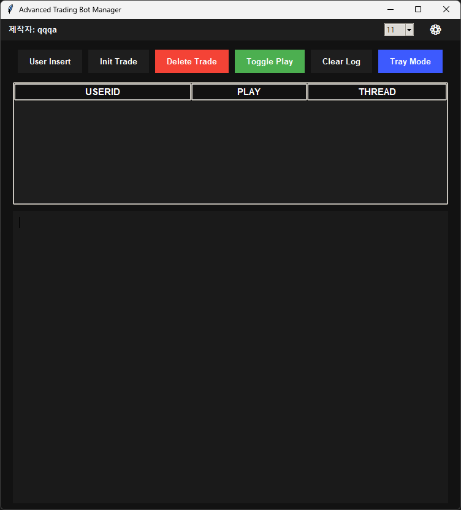
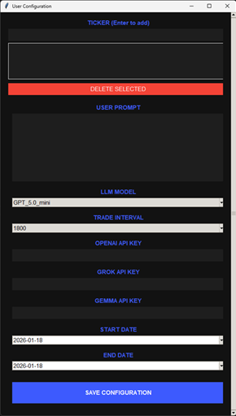

# Prompt 기반 LLM Virtual Trade Backtesting
---

## 해당 프로그램은 실제 트레이딩 전 백테스팅용 프로그램입니다.
## 실제 거래 코드는 등록되어 있지 않습니다.
> ⚠️ **Warning**  
> LLM API 호출 비용이 발생합니다.
 

## This is a backtesting program designed to evaluate trading strategies before deploying them in real trades.
## The actual trading code is not included.
> ⚠️ **Warning**  
> LLM API usage will incur costs.
---

## Process 

- 마켓 데이터와 전략으로 LLM이 얼마만큼 수익을 낼 수 있는지 테스트 하기위한 백테스팅 프로그램 입니다.
- 마켓 데이터 지원 목록은 indicators.py 파일 확인 부탁드립니다.
 

- This is a backtesting application used to evaluate the profitability of LLM-driven trading strategies based on market data.
- The list of supported market data indicators can be found in the `indicators.py` file.
---

### Support Model : LLM API Model
- GPT-5.0-mini
- Gemini 3.0 Flash preview
- Gemini 2.5 Pro
### Required Software
- Database : Postgres
- Database Viewr : pgadmin
### Market Data API
- Exchange : Upbit
### Runtime Environment
- Windows 11
---

## Start FORM

- **DB_HOST**: Database host (e.g., `localhost`)
- **DB_USER**: PostgreSQL username (e.g., `postgres`)
- **DB_PASSWORD**: PostgreSQL user password
- **DB_NAME**: Your database name
- **DB_PORT**: Database port (e.g., `5432`)
 

- Setting Fail
 

- Setting Success
 

- If the process succeeds, a `.env` file and a `logs` folder will be generated.

## User Insert FORM

- **Ticker**: 거래할 코인 티커 (예: BTC, SOL)  
- **User Prompt**: 전략 입력 (예: MA 20 도달 시 거래, 손절 -3%, 목표 +5%)  
- **LLM Model**: 사용할 모델 선택 (비용 확인 필요)  
- **Trade Interval**: 거래 주기 (30분 / 1시간 / 4시간 / 1일) ⚠️ 호출 많으면 비용 증가  
- **API Key**: 모델 호출용 키  
- **Start / End Date**: 거래 시작·종료 시간  

작성 완료 후 **SAVE CONFIGURATION** 버튼을 눌러 저장하세요.  
pgAdmin DB 내 테이블을 확인하여 정상 등록 여부를 확인할 수 있습니다.
 

- **Ticker**: Coin ticker to trade (e.g., BTC, SOL)  
- **User Prompt**: Enter your trading strategy (e.g., trade when MA 20 is reached, stop-loss -3%, target +5%)  
- **LLM Model**: Select the LLM model to use (check costs)  
- **Trade Interval**: Trading interval (30min / 1h / 4h / 1d) ⚠️ Excessive calls increase cost  
- **API Key**: API key for calling the model  
- **Start / End Date**: Trading start and end time  

Click **SAVE CONFIGURATION** after completing the form. Check the pgAdmin DB table to confirm proper registration.
---

## FORM ACTION Key

- **Font Size Combobox**: 우측 상단바에서 폰트 크기 조절  
- **Dark/Light Mode**: 다크/라이트 모드 전환 버튼  
- **Init Trade**: 초기 자금 설정 (실행 전 반드시 클릭)  
- **Delete Trade**: DB에 저장된 거래 기록 초기화  
- **Toggle Play**: 리스트 박스에서 유저 선택 후 클릭 → 백테스팅 시작  
- **Clear Log**: 로그 패널 초기화  
- **Tray Mode**: 트레이 모드 전환
 

- **Font Size Combobox**: Adjust font size at the top-right bar  
- **Dark/Light Mode**: Toggle dark/light mode  
- **Init Trade**: Set initial capital (must click before execution)  
- **Delete Trade**: Clear trade records stored in DB  
- **Toggle Play**: Select a user from the list box → click to start backtesting  
- **Clear Log**: Clear the log panel  
- **Tray Mode**: Toggle tray mode
---

## Prompt / Market Data
- `prompt.py` 파일 내 프롬프트 변경란이 있습니다. output form 형태를 변경하면 정상 출력이 불가 합니다.
- 통화 화폐 단위는 KRW입니다.
- 출력 언어를 변경하시려면 `prompt.py` 내 self.country 를 모국 코드로 변경하십시오
 

- There is a prompt section in the `prompt.py` file. Changing the output form may prevent proper output.  
- The currency unit is KRW.  
- To change the output language, modify `self.country` in `prompt.py` to your native country code.

> ⚠️ **내부 수정은 가능하나, 원본 코드의 권리는 작성자에게 있습니다.**  
> ⚠️ **You may modify internally, but the rights to the original code belong to the author.**
